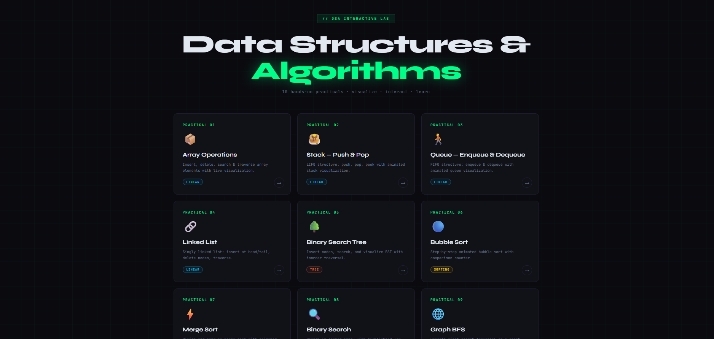

# 🚀 DSA Interactive Lab

An interactive and visually rich **Data Structures & Algorithms Lab** built to help students understand core DSA concepts through **real-time visualization and hands-on practicals**.

---

## 👨‍💻 Developed By

**Yash Jain**

---

## 📌 Project Overview

This project is a collection of **10 interactive DSA practicals** designed for academic learning and concept visualization.
Each module allows users to perform operations and see how algorithms work step-by-step.

---

## 🎯 Key Features

* 🎨 Modern Dark UI with clean design
* ⚡ Real-time algorithm visualization
* 🧠 Beginner-friendly learning approach
* 📊 Interactive simulations
* 📱 Fully responsive layout

---

## 📚 Practicals Included

| Practical No. | Topic                     |
| ------------- | ------------------------- |
| 01            | Array Operations          |
| 02            | Stack (Push & Pop)        |
| 03            | Queue (Enqueue & Dequeue) |
| 04            | Linked List               |
| 05            | Binary Search Tree        |
| 06            | Bubble Sort               |
| 07            | Merge Sort                |
| 08            | Binary Search             |
| 09            | Graph BFS                 |
| 10            | Hashing (Hash Table)      |

---

## 🛠️ Technologies Used

* HTML5
* CSS3 (Animations + UI Design)
* JavaScript (Vanilla JS)
* Google Fonts (JetBrains Mono, Syne)

---

## 📂 Project Structure

```
📦 dsa-interactive-lab
 ┣ 📂 practicals
 ┃ ┣ p1-array.html
 ┃ ┣ p2-stack.html
 ┃ ┣ p3-queue.html
 ┃ ┣ p4-linkedlist.html
 ┃ ┣ p5-bst.html
 ┃ ┣ p6-bubble.html
 ┃ ┣ p7-mergesort.html
 ┃ ┣ p8-binsearch.html
 ┃ ┣ p9-graph-bfs.html
 ┃ ┗ p10-hashing.html
 ┣ 📄 index.html
 ┗ 📄 README.md
```

---

## 🚀 Getting Started

### 🔹 Run Locally

1. Download or clone this repository
2. Open `index.html` in your browser

### 🔹 Using Live Server

1. Open project in VS Code
2. Install Live Server extension
3. Right-click → Open with Live Server

---

## 🌐 Deployment

You can deploy this project for free using:

* GitHub Pages
* Netlify
* Vercel

### GitHub Pages Setup:

1. Go to repository **Settings**
2. Click on **Pages**
3. Select branch → `main`
4. Click **Save**
5. Your project will be live 🚀

---

## 📸 Preview

<p align="center">
  
</p>

---

## 🎓 Educational Use

This project is designed for:

* MCA / BCA / B.Tech students
* Beginners learning DSA
* Lab practical demonstrations

---

## 🔮 Future Improvements

* Add DFS visualization
* Add time complexity analysis
* Add step-by-step execution control
* Add code editor integration
* Add quizzes for practice

---

## ⭐ Support

If you found this project helpful:

* ⭐ Star this repository
* 🍴 Fork it
* 📢 Share with others

---

## 📜 License

This project is open-source and free to use for educational purposes.

---

